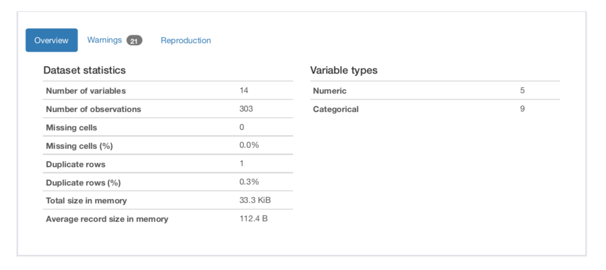

# CVD Risk Analysis & Prediction Using Logistic Regression

#### Machine learning enhances preventive care in cardiovascular medicine

Sara Farhat 

Oct 14,2021      

  

  

## 1.Introduction

Globally

Cardiovascular diseases (CVDs) are the leading cause of death globally.
An estimated 17.9 million people died from CVDs in 2019, representing 32% of all global deaths. 

United States

Heart disease is the leading cause of death for men, women, and people of most racial and ethnic groups in the United States.
One person dies every 36 seconds in the United States from cardiovascular disease.
Heart disease costs the United States about $363 billion each year from 2016 to 2017. This includes the cost of health care services, medicines, and lost productivity due to death.

Therefore, it is important to detect cardiovascular disease as early as possible so that management with counselling and medicine can begin.

But, it can be difficult to identify high risk CVD patients due to the multi-factorial nature of risk factors.This is where machine learning models can be used to help in early detection of high risk patients.

In this article, I will be analyzing several contributory risk factors to predict whether a patient is at a high risk for developing CVD using Logistic Regression on UCI Health dataset.

## 2.Data Set Description

This dataset is from UCI Health dataset found publicly on Kaggle. 

This database contains 76 attributes, but all published experiments refer to using a subset of 14 of them. So for the purpose of this project, I will be using the 14-commonly used variables. 

### Variable Description

#### Demographic

- age : age of the patient in years 
- sex : (1 = male; 0 = female) 

#### Existing Medical Conditions

- cp : chest pain type (0 = typical angina,1 = atypical angina, 2= non-anginal pain, 3 = asymptomatic)
- trestbps : resting blood pressure (in mm Hg on admission to the hospital)
- chol : serum cholestoral in mg/dl
- fbs : (fasting blood sugar > 120 mg/dl) (1 = true; 0 = false)
- restecg : resting electrocardiographic results (0 = normal, 1 = ST-T wave abnormality, 2 = Possible LV hypertrophy)¶
- thalach : maximum heart rate achieved
- exang : exercise induced angina (1 = yes; 0 = no)
- oldpeak : ST depression induced by exercise relative to rest
- slope : the slope of the peak exercise ST segment ( 0 = Upsloping, 1 = Flat slope , 2 = Downsloping)
- ca : number of major vessels (0-3) colored by flourosopy
- thal : 3 = normal; 6 = fixed defect; 7 = reversable defect

##### For more explanation regarding the variables please refer to the below research study: 

https://www.mdpi.com/2076-3417/11/18/8352/pdf

#### Target variable to be predicted

- target : 0 = There's a lower chance of heart attack , 1 = There's a higher chance of heart attack

## Documentation

For the full code, please refer to the link below. All code was created and implemented in a Python Jupyter Notebook.

https://github.com/Sara-Farhat/Cardiovascular-Disease-Risk-Prediction-Logistic-Regression/blob/main/CVD%20Risk%20Prediction.pdf

## Approach

1. Data Cleaning & Pre-processing

I started by checking for missing values and  duplicate values by creating a Pandas Profiling Report. Missing and duplicate variables can affect the performance of a machine learning model. 
There were no missing variables. There was 1 duplicate entry that I dropped.

2. Exploratory Data Analysis

First, I checked the distribution of different variables with respect to the target variable using a scatterplot heat matrix. 
The scatterplot helps us easily identify categorical vs continuous variables.

Variables: Age, sex, chest pain, resting electrocardiogram, slope pf peak exercise ST, number of major vessels colored by fluoroscopy,exercise induced angina, Thalassemia, fasting blood glucose, serum cholesterol,ST depression induced by exercise and maximum heart rate achieved are associated with an increased/decreased risk for CVD.

Whereas, resting blood pressure didn't present with an association to an increased or decreased CVD risk. 

To get more accurate insights, I analyzed different variables:
- wrt target variable
- wrt Age
- wrt sex

I created very interesting visualizations using Plotly Express package.

I was able to conclude based on my EDA: 

. Female patients in this dataset presented with a higher risk for CVD than men.
 
 

. Patients older than 40 years old presented with a higher risk for CVD irrespective of sex.

. Female patients with a fbs < 120 mg/dl presented with a high risk for CVD !!

. Both male and female patients with no exercise induced angina presented with an increased risk for CVD; highest in female patients.

. Both male and female patients with a downward ST-slope presented with an increased risk for CVD; highest in female patients.

 

. Patients with resting blood pressure between 120 and 140 / mm Hg, surprisingly, presented with both high and low risk for CVD.

I can conclude as well, that the association between some of the variables and an increased CVD risk seemed to be stronger in female patients. 

*This shows that the detection of increased risk for developing heart disease in patients is a  complicated task. 

*There are many players that contribute to increasing the risk. Machine learning can help in predicting CVD risk while taking into consideration all these interconnected variables.

3. Selecting and buidling the Model

Since the target variable in this task is of a categorical binary type; I will choose Logistic regression (a suprevised classification algorithm)to help predict the impact of each variable on the odds ratio of the observed event of interest which is risk for CVD.

Logistic regression is a linear method, but the predictions are transformed using the logistic function. 

p(X) = e^(b0 + b1*X) / (1 + e^(b0 + b1*X))

3.1 Feature encoding

I started by creating a copy of the dataset. Then, I encoded the categorical columns by creating dummy variables.

3.2 Feature Selection

I then, selected the input and output features.

3.3 Splitting Data

I split the data for training and testing purposes. I took 80% of the data to use it to train my LR model and then test it on the remaining 20%.

3.4 Feature scaling

I,then, scaled the continuous features, using RobustScaler , to treat for possible outliers that may affect the performance of my model.

3.5 Model Fitting

Now, my model is ready for fitting.

I instantiated the model using the default parameters.

I fitted the model on my training data to predict the labels of the test data.

4. Model Evaluation

Now, that the prediction is over.

I used the Confusion Matrix to evaluate the performance of my model.

The CM shows that the model resulted in 55 correct predictions and 6 incorrect ones.

For further model evaluation, I used these commonly used metrics for LR model evaluation: accuracy, F1 SCORE, recall score and precision.

- Accuracy of a model is the proportion of predictions that the model classified correctly. Which is 90.16% for our model;90% of predictions are classified correctly.

- F1 score is the harmonic mean of precision and recall. It is the measure of the preciseness and robustness of the model. The closer it is to 1, the better is the model at predicting the target variable.

- Recall score is the proportion of actual positives that were identified correctly by model.

- Precision is the proportion of positive identifications that were classified correctly by model.

Hence,the Logistic Regression model's performance was great at predicting risk for CVD.

# Conclusion

As a conclusion, the Logistic Regression model's performance was great at predicting risk for CVD by using the 14 attributes.

A provider can input values corresponding to each of the 14 attributes, into the model and predict whether his/her patient is at risk for developing CVD. This can help the provider to start the right treatment for the right patient to prevent any further complications, taking into consideration the time-sensitive nature of heart disease complications such as stroke,cardiac arrythmia, heart failure, MI,etc.

This project is an example of how machine learning can help us: 
. improve healthcare operations
. improve healthcare outcomes 
. improve quality of life 
. cut unnecessary costs that burden our system.

# Dashboard for CVD Risk Prediction

Using Tableau Public, I was able to create an interactive dashboard that predicts CVD risk according to different variables. 

The link to the dashboard: https://public.tableau.com/app/profile/sara.farhat8454/viz/CVDRiskAnalysis/Dashboard2

Thank you for reading.

Feel free to share any thoughts.
